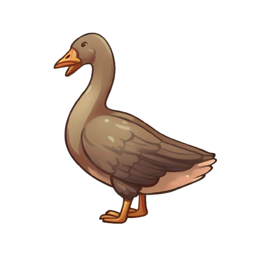

# Oca Acuarela: Viaje Colorido

Este proyecto es un juego educativo basado en el clásico juego de la oca, llamado “**Oca acuarela: viaje colorido**”. Es un juego que permite al profesor ingresar las preguntas que quiere que sus estudiantes respondan mientras avanzan por el tablero.

El juego consiste en un tablero de 63 casillas y 4 fichas de diferentes colores que los jugadores pueden elegir. El objetivo es llegar a la casilla final antes que los demás. Para ello, los jugadores deben lanzar un dado y mover su ficha el número de casillas que indique el dado. Si caen en una casilla con una pregunta, deben responderla correctamente para poder seguir jugando. Si se equivocan, pierden el turno.

El tablero tiene varias casillas especiales que le dan más emoción al juego:

- **La casilla oca**: si caes en una casilla oca, avanzas hasta la siguiente casilla oca y vuelves a lanzar el dado.
- **La casilla portal**: si caes en una casilla portal, te teletransportas a otra casilla portal al azar.
- **La casilla calavera**: si caes en una casilla calavera, retrocedes hasta la casilla inicial y pierdes todos tus puntos.

El juego tiene un diseño simple y atractivo, con colores pastel y animaciones. Se enfatiza que es una herramienta educativa que facilita el aprendizaje de los estudiantes. Se reconoce la idea original del juego a los creadores de PhiloGame.

## Características

Oca acuarela es un juego que tiene las siguientes características:

- **Educativo**: permite al profesor crear preguntas personalizadas sobre cualquier tema que quiera enseñar a sus estudiantes.
- **Divertido**: tiene un diseño colorido y animado que capta la atención de los niños y niñas.
- **Dinámico**: tiene varias casillas especiales que hacen que el juego sea más interesante y variado.
- **Fácil de jugar**: solo se necesita un tablero, un dado y una ficha por jugador.
- **Adaptable**: se puede jugar con diferentes niveles de dificultad y duración según las preferencias del profesor y los estudiantes.

## Nuestro Equipo

Los participantes de este proyecto actual son:

### Programadores
- Roger Negrete
- Jose Guallasamin
- Carlos Astudillo

Se aclara que PhiloGame es un proyecto completamente independiente y solo se tomó la idea principal como inspiración.

## Información de contacto

Si quieres saber más sobre este proyecto o contactar con alguno de los participantes, puedes escribirnos a los siguientes correos electrónicos:

- Roger Negrete: rnegretec@est.ups.edu.ec
- Jose Guallasamin: jguallasaminc@est.ups.edu.ec
- Carlos Astudillo: castudillov1@est.ups.edu.ec

Esperamos que disfrutes de Oca acuarela: viaje colorido.

## PhiloGame

Los creadores originales del juego son:

### Ideadores
- Michelle Inca
- Cristian Lita
- Joaquin Garces
- Cristina Quishpe

### Programadores
- Jhon Olalla
- Jose Guallasamin
- Lenin Llano

### Diseñadores
- Hiriam Garces
